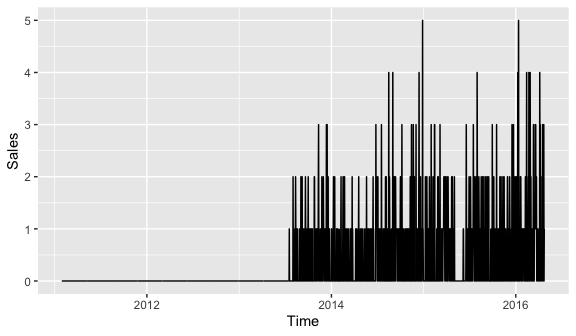

M5comp
======

M5 Competition Data

Installation
------------

You can install the package `M5comp` with:

``` r
devtools::install_github("xqnwang/M5comp")
```

Aggregation
-----------

**Number of M5 series per aggregation level.**

|  Level id | Aggregation level                                                    |  Number of series|
|:---------:|:---------------------------------------------------------------------|-----------------:|
|   **1**   | Unit sales of all products, aggregated for all stores/states         |                 1|
|   **2**   | Unit sales of all products, aggregated for each State                |                 3|
|   **3**   | Unit sales of all products, aggregated for each store                |                10|
|   **4**   | Unit sales of all products, aggregated for each category             |                 3|
|   **5**   | Unit sales of all products, aggregated for each department           |                 7|
|   **6**   | Unit sales of all products, aggregated for each State and category   |                 9|
|   **7**   | Unit sales of all products, aggregated for each State and department |                21|
|   **8**   | Unit sales of all products, aggregated for each store and category   |                30|
|   **9**   | Unit sales of all products, aggregated for each store and department |                70|
|   **10**  | Unit sales of product x, aggregated for all stores/states            |              3049|
|   **11**  | Unit sales of product x, aggregated for each State                   |              9147|
|   **12**  | Unit sales of product x, aggregated for each store                   |             30490|
| **Total** | -                                                                    |             42840|

**The following table shows more simply and clearly how the aggregated time series are generated. For example, series of level 11 are aggregated by series with the same `item.id` and `state.id`.**

|Level id|id|item.id|dept.id|cat.id|store.id|state.id|
|--- |--- |--- |--- |--- |--- |--- |
|(example)|(HOBBIES_1_001_CA_1)|(HOBBIES_1_001)|(HOBBIES_1)|(HOBBIES)|(CA_1)|(CA)|
|1|||||||
|2||||||✓|
|3|||||✓||
|4||||✓|||
|5|||✓||||
|6||||✓||✓|
|7|||✓|||✓|
|8||||✓|✓||
|9|||✓||✓||
|10||✓|||||
|11||✓||||✓|
|12|✓||||||


Example
-------

The package `M5comp` contains two datasets: `M5` and `calendar`.

### M5

The `M5` is a list of 42840 series, including 30490 bottom-level time series and 12350 aggregated time series. Each element of this list is also a list with some components, like the time series of the training periods and the level id of the series. The components of the bottom-level series and the aggregated series are partially different.

``` r
# extract bottom-level series (level 12)
library(M5comp)
data(M5)
M5_bottom <- Filter(function(l) l$level == 12, M5)
# the structure of the bottom-level series
str(M5_bottom[[1]])
#> List of 13
#>  $ id       : chr "HOBBIES_1_001_CA_1"
#>  $ level    : num 12
#>  $ item.id  : chr "HOBBIES_1_001"
#>  $ dept.id  : chr "HOBBIES_1"
#>  $ cat.id   : chr "HOBBIES"
#>  $ store.id : chr "CA_1"
#>  $ state.id : chr "CA"
#>  $ n        : int 1913
#>  $ h        : num 28
#>  $ x        : Time-Series [1:1913] from 1 to 1913: 0 0 0 0 0 0 0 0 0 0 ...
#>  $ x.price  : num [1:1913] NA NA NA NA NA NA NA NA NA NA ...
#>  $ xx.price : num [1:28] 8.38 8.38 8.38 8.38 8.38 8.38 8.38 8.38 8.38 8.38 ...
#>  $ xxx.price: num [1:28] 8.38 8.38 8.38 8.38 8.38 8.38 8.38 8.38 8.38 8.38 ...

# extract extract level 9 series
M5_l9 <- Filter(function(l) l$level == 9, M5)
# the structure of the aggregated series
str(M5_l9[[1]])
#> List of 9
#>  $ level   : num 9
#>  $ agg.by  : Named chr [1:2] "FOODS_1" "CA_1"
#>   ..- attr(*, "names")= chr [1:2] "dept.id" "store.id"
#>  $ dept.id : chr "FOODS_1"
#>  $ cat.id  : chr "FOODS"
#>  $ store.id: chr "CA_1"
#>  $ state.id: chr "CA"
#>  $ n       : int 1913
#>  $ h       : num 28
#>  $ x       : Time-Series [1:1913] from 1 to 1913: 297 284 214 175 182 191 224 263 245 176 ...
# which levels the series is aggregated on
M5_l9[[1]]$agg.by
#>   dept.id  store.id 
#> "FOODS_1"    "CA_1"
```

### calendar

The calendar data contains information about the dates the products are sold. The `calendar` object is a dataframe with some components, such as date, weekday and event\_name\_1.

``` r
# the structure of the calendar data
data(calendar)
str(calendar)
#> 'data.frame':    1969 obs. of  14 variables:
#>  $ date        : Date, format: "2011-01-29" "2011-01-30" ...
#>  $ wm_yr_wk    : Factor w/ 282 levels "11101","11102",..: 1 1 1 1 1 1 1 2 2 2 ...
#>  $ weekday     : Factor w/ 7 levels "Monday","Tuesday",..: 6 7 1 2 3 4 5 6 7 1 ...
#>  $ wday        : Factor w/ 7 levels "1","2","3","4",..: 1 2 3 4 5 6 7 1 2 3 ...
#>  $ month       : Factor w/ 12 levels "1","2","3","4",..: 1 1 1 2 2 2 2 2 2 2 ...
#>  $ year        : Factor w/ 6 levels "2011","2012",..: 1 1 1 1 1 1 1 1 1 1 ...
#>  $ d           : Factor w/ 1969 levels "d_1","d_2","d_3",..: 1 2 3 4 5 6 7 8 9 10 ...
#>  $ event_name_1: Factor w/ 31 levels "","Chanukah End",..: 1 1 1 1 1 1 1 1 28 1 ...
#>  $ event_type_1: Factor w/ 5 levels "","Cultural",..: 1 1 1 1 1 1 1 1 5 1 ...
#>  $ event_name_2: Factor w/ 5 levels "","Cinco De Mayo",..: 1 1 1 1 1 1 1 1 1 1 ...
#>  $ event_type_2: Factor w/ 3 levels "","Cultural",..: 1 1 1 1 1 1 1 1 1 1 ...
#>  $ snap_CA     : Factor w/ 2 levels "0","1": 1 1 1 2 2 2 2 2 2 2 ...
#>  $ snap_TX     : Factor w/ 2 levels "0","1": 1 1 1 2 1 2 1 2 2 2 ...
#>  $ snap_WI     : Factor w/ 2 levels "0","1": 1 1 1 1 2 2 1 2 2 1 ...
```

``` r
# plot one of the series with date
library(ggplot2)
library(xts)
library(magrittr)
xts(M5[[1]]$x, order.by = calendar$date[1:M5[[1]]$n]) %>% 
   autoplot() + xlab("Time") + ylab("Sales")
```



``` r
# help pages
?M5
?calendar
```

License
-------

This package is free and open source software, licensed under GPL-3
